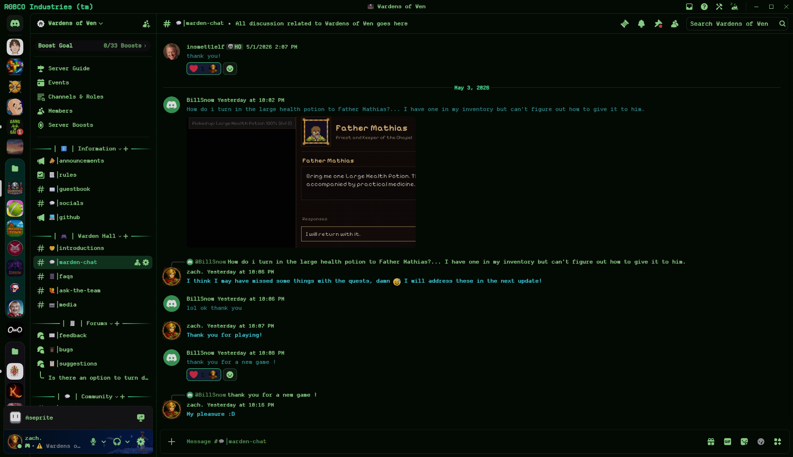
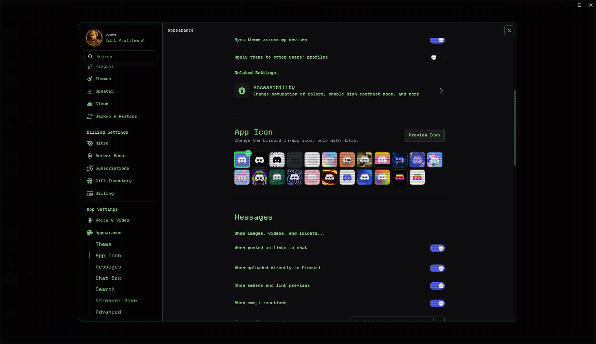
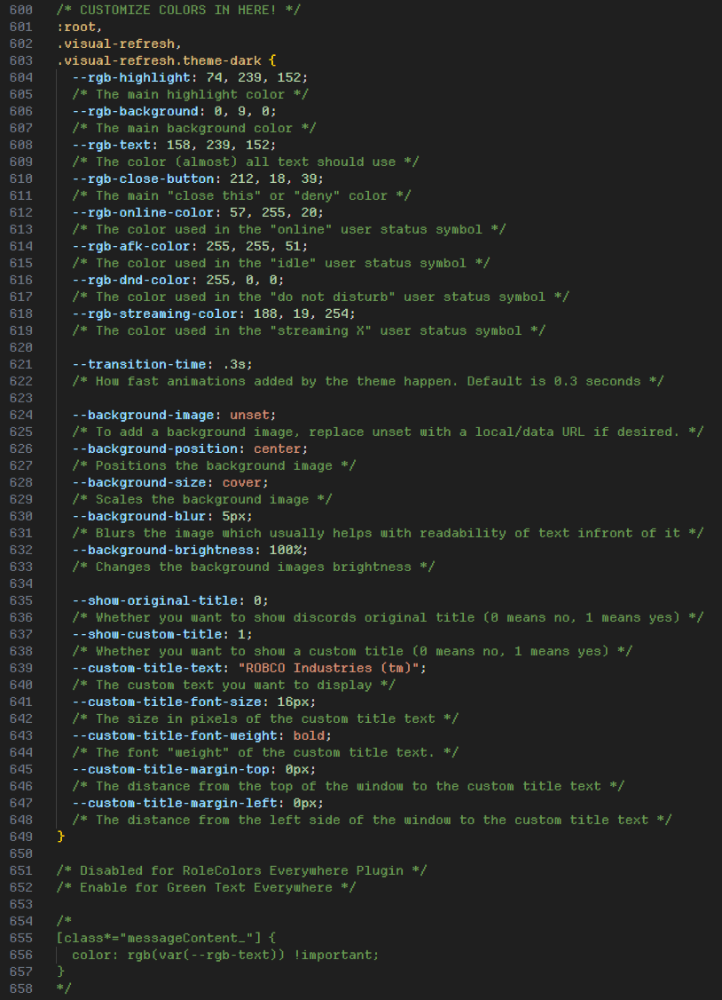
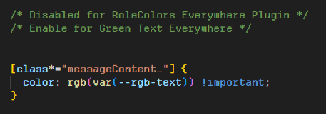

  

  

<h1 align="center">Fallout 4 Terminal Theme</h1>

<h2>About</h2>

This is my first Discord theme, though you may not even be able to call it that. I restored and fixed a few things in the theme, and added some things that I think make it better!

<h2>Installation</h2>

Installing betterdiscord themes is really easy!
- Go into discord's settings
- Go to "Themes"
- Click on "Open theme folder"
- Move the .theme.css file you downloaded into the folder you just opened
- Click the checkbox in the top-right corner of the theme in discord to enable it

<h2>Customization</h2>

You can easily customize this theme by editing the .theme.css file! Just change the variables to whatever you want!

Uncomment the bottom block like so;

To restore all-green text.

<h2>Need more help?</h2>

No worries! Just head on over to my <a href="https://discord.gg/XRnuHY5uuS" target="_blank">Discord Server</a>, you'll be sure to find whatever help you need customizing over there! :)

<h2>Want to support me?</h2>
Buy my game on Steam; <a href="https://store.steampowered.com/app/4458750/Wardens_of_Wen/" target="_blank">Wardens of Wen</a>!

Come join the <a href="https://discord.gg/wNkKJES6QY" target="_blank">Wardens of Wen Discord Server</a>!

<h2>Credits</h2>

The original theme was made by <a href="https://github.com/B4T3S/Fallout4TerminalTheme" target="_blank">B4T3S</a>.